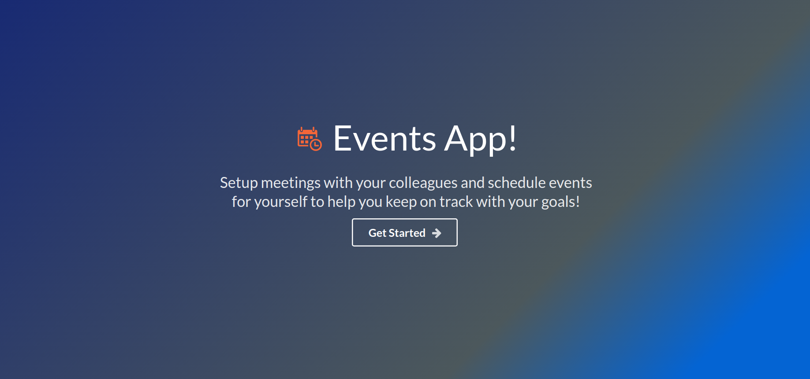
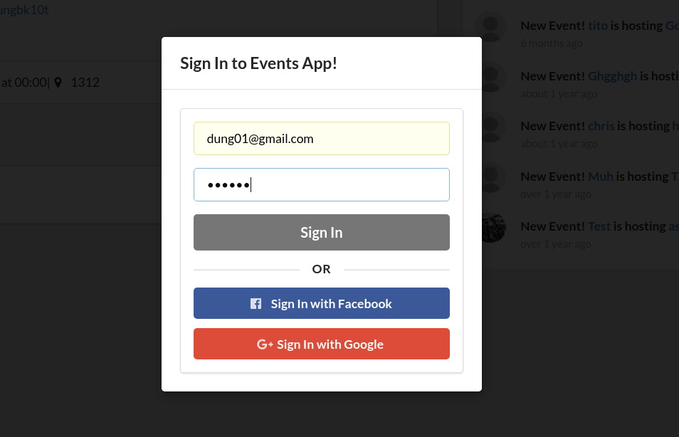
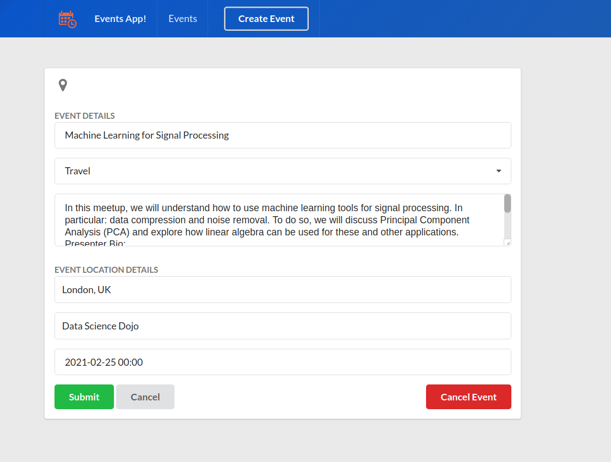
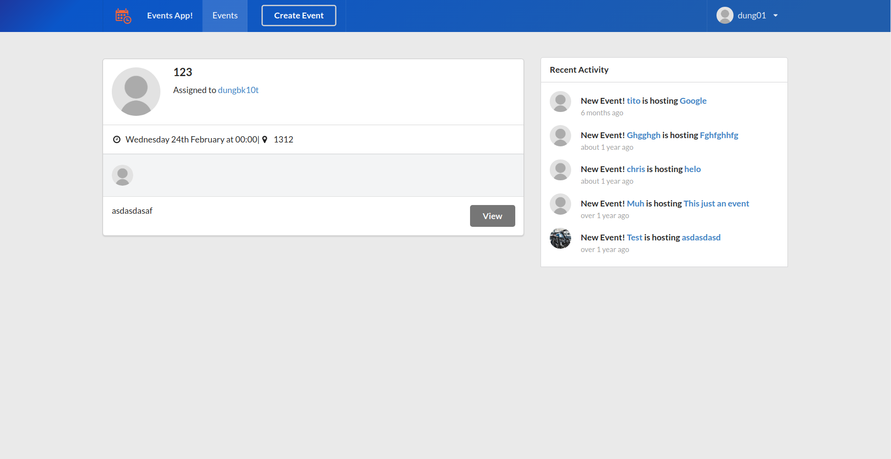
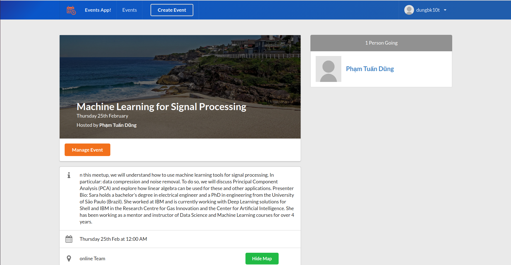
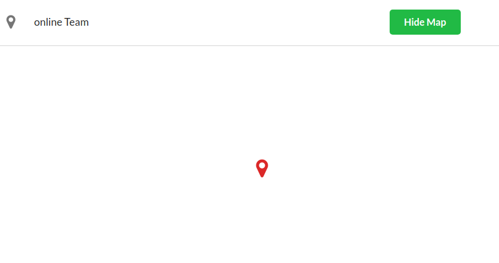
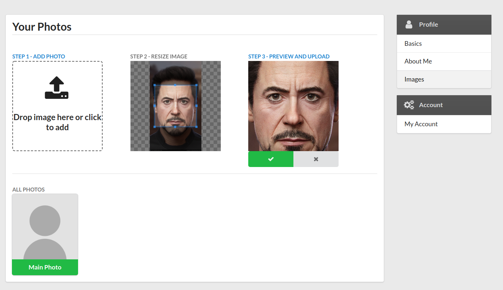

# Events app

 
*This is the home page!* 

Please check out [Events App](http://events-app-220700.firebaseapp.com/) to study the app's basic functionality which is still in development! This app is an example of using Google Maps, Firebase, Firestore, Cloud Functions, Authentication, React, Redux Thunk and Semantic-UI React to build a web based application to schedule events, and meetings with your business partners to help keep moving your business ideas and projects forward! 

 
*The email and Google/Facebook login - please note Facebook login isn't setup yet!*

 
*Your event form to create, and cancel events!*

 
*The events page with infinite scroll and a activity feed showing live events*

 
*The Event Page which shows `event_attendees`, event info, and the great chat! This chat features uses real-time database Firebase!*

 
*Google Maps in action! Toggle hide/show map! Please note I have a 1 per day limit quota for my API so you may not see full map*

 
*The image upload page in the ->profile/settings/images section this utilizes Firestore*

 
*This is an example of how the image upload from the UI would be stored in Firestore. Firestore uses collections and documents are added to that collection with fields that are certain values. This was a great learning experience on image uploads!* 

 
*Taking advantage of monitoring Redux Chrome Extension to show event actions*

 
*Firestore collection and document schema for `users`, `events` and we added `activities` and `event_attendees` as well. Understanding what your collections are is a great practice for naming conventions as well.*

 
*Firebase Cloud Functions! This was my first experience with a almost serverless backend. Essentially you are running "functions" stored in `Cloud Functions` that get triggered by Firebase code you implement and HTTPS requests. Fascinating!! In this case there was a createActivity function and cancelActivity function to handle when users were "creating" and "canceling" events!*

